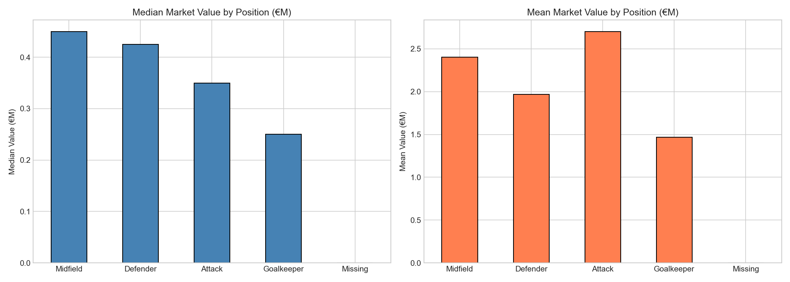
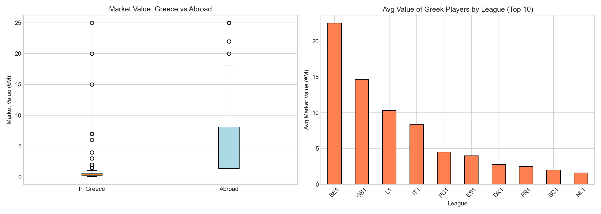
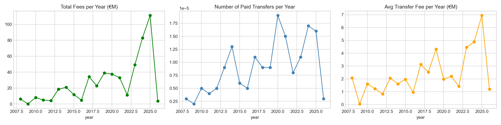
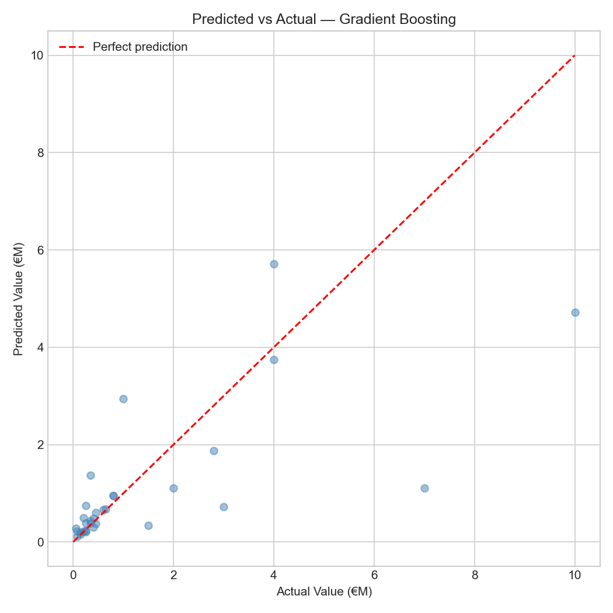
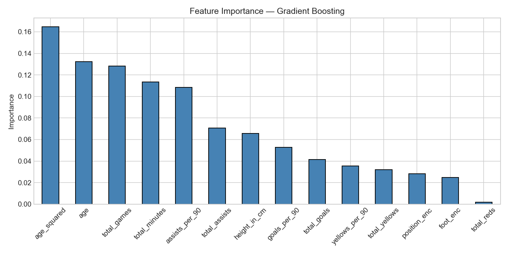
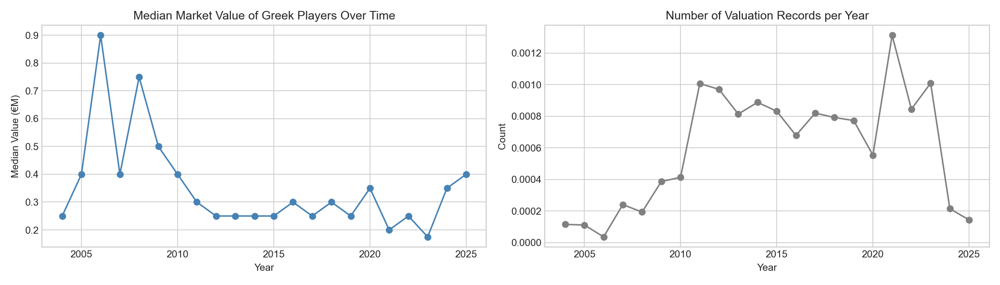

# Greek Players Market Value — ML Analysis

A football analytics project that explores the market value of Greek professional players using Transfermarkt data. The project filters a large multi-table dataset down to Greek players, performs exploratory data analysis, and trains machine learning models to predict current market value.

## Dataset

Source: [Transfermarkt](https://www.transfermarkt.com) via Kaggle — 10 CSV files (~611 MB total).

| Scope | Count |
|-------|-------|
| Active Greek players analysed | 195 |
| Transfer records (Greek players) | 2,004 |
| Valuation snapshots (2004–2025) | 13,155 |
| Median current value | €400K |
| Highest current value | €25M |

All monetary values are in EUR.

## Project Structure

```
├── data/               # Raw CSVs (not tracked in git — too large)
├── notebooks/          # Six Jupyter notebooks (run in order)
├── outputs/
│   ├── figures/        # All saved charts
│   └── models/         # Saved model (best_model.pkl)
```

## Notebooks

Run in this order — each notebook reads parquet files produced by the previous one.

| # | Notebook | What it does |
|---|----------|-------------|
| 01 | `01_load_and_filter.ipynb` | Loads raw CSVs, filters to Greek players, saves intermediate parquets |
| 02 | `02_eda.ipynb` | EDA: age distribution, position breakdown, value distribution, top 15 by peak value |
| 03 | `03_joins_comparison.ipynb` | Joins with club/competition data; compares values of players in Greece vs abroad |
| 04 | `04_transfers.ipynb` | Transfer fee trends, destination leagues, transfer routes |
| 05 | `05_valuations.ipynb` | Market value trajectories over time by position and individual player |
| 06 | `06_ml.ipynb` | Trains and compares three models; saves best model |

## ML Model

Three models are trained and compared on a held-out test set (80/20 split):

- `LinearRegression`
- `RandomForestRegressor` (100 estimators)
- `GradientBoostingRegressor` (100 estimators) ← **best model**

**Target**: `market_value_in_eur`, log-transformed (`np.log1p`) to address right skew.

**Features**: age, age² (non-linear peak effect ~22–26), height, position, preferred foot, and career aggregates from match appearances (total games, goals, assists, minutes, cards; per-90 rates).

**Model selection**: highest R² on log-scale predictions. Best model is saved to `outputs/models/best_model.pkl`.

## Setup

```bash
pip install pandas numpy matplotlib scikit-learn scipy pyarrow jupyter
```

Place the raw Transfermarkt CSV files in the `data/` directory, then launch:

```bash
jupyter notebook
```

Open and run notebooks 01–06 in order.

## Key Findings

- **Attackers and midfielders** command significantly higher median values than defenders and goalkeepers.
- **Players based abroad** are valued substantially higher than those playing in the Greek Super League.
- **Age peak** is around 22–26; the model captures this with an `age²` feature.
- **Top current values** (active players): Christos Tzolis, Konstantinos Koulierakis, Stefanos Tzimas, Giannis Konstantelias.

## Sample Charts

| | |
|---|---|
|  |  |
|  |  |
|  |  |
